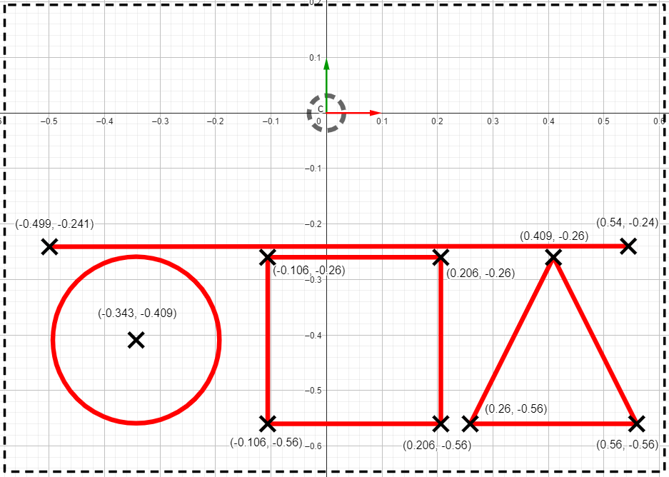

# Advanced Programming for Robots - TurtleBot Simulation

## Context
1. [General Information](#general-information)
2. [Installation](#installation)
3. [Usage](#usage)

## General Information

Test

The Reference World Frame has its origin in the centor of the cylinder Placed on the map. The relevant Waypoints are visualized in the following graphic



## Installation

- Install ROS on your Workstation (preferably ROS-Noetic / Ubuntu 20.04).

     Follow this [Tutorial](http://wiki.ros.org/noetic/Installation/Ubuntu) (Install the Desktop-Full-Version for Gazebo).

-  Create, Build and Source a new ROS Workspace

    ```BASH
    mkdir -p ~/apr_ws/src
    cd ~apr_ws
    catkin_make
    source ~/apr_ws/devel/setup.bash
    ```

- Navigate to the src folder of your ROS-Workspace and clone the [git repository](https://github.com/fynnbehnke/mre1-APR-Simulation.git)
    
    ```BASH
    cd ~/apr_ws/src
    git clone https://github.com/fynnbehnke/mre1-APR-Simulation.git
    ```

- After that Build and Source once again
    
    ```BASH
    catkin_make
    source ~/apr_ws/devel/setup.bash
    ```

- Before each start set the Turtlebot Variable to Model-Burger or write it in the ~/.bashrc
     ```BASH
     export TURTLEBOT3_MODEL=burger
     ```


## Usage

- To run the Simulation simply launch the start_sim launch-file of the apr_sim package
    ```BASH
    roslaunch apr_sim start_sim.launch
    ```
    
- Once the nodes are running you can monitor the sensor data using telnet:
     ```BASH
     telnet <ip_address> 9997 # For the LiDAR Data
     telnet <ip_address> 9998 # for the Odometry Data
     ```
     or using your listener nodes on the ports:
     - 9997 (LiDAR Data)
     - 9998 (Odometry Data)

- To control the turtlebot send the starting command to the port 9999 either via telnet or your commander

     For example:
     ```BASH
     telnet <ip_address> 9999
     ---START---{"linear": 0.1, "angular": 0.10}___END___
     ---START---{"linear": 0.0, "angular": 0.00}___END___
     ```
